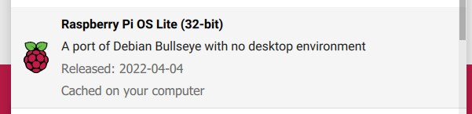
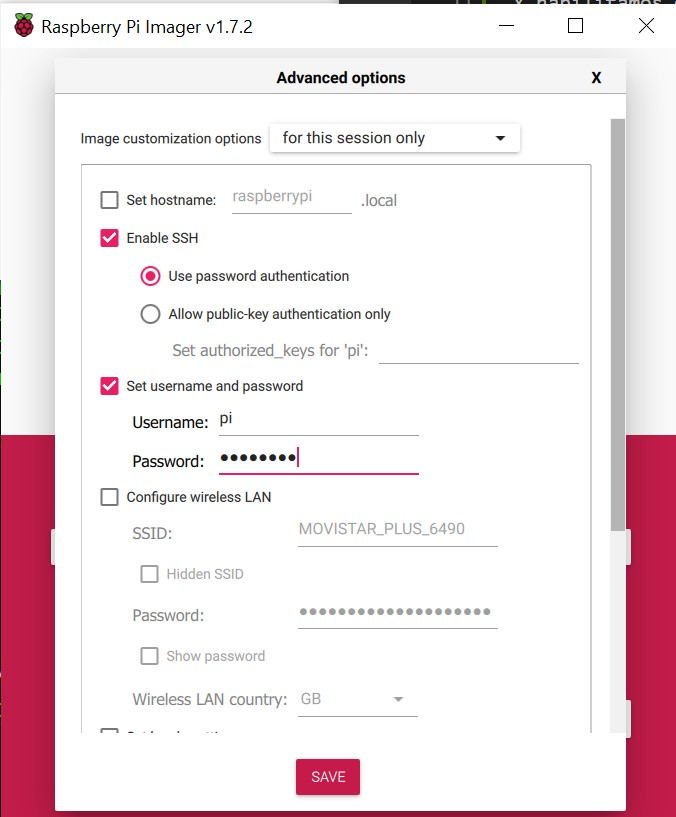

# PiPortalCautivo

Configuración de una Raspberry Pi como un portal cautivo

## Imagen Base

Empleamos como base Raspberry Pi OS Lite 32-bit en una Raspberry Pi B+



Y habilitamos en `Opciones`
- Enable SSH: Use password auth...
- Username: pi
- Password: raspbian



## Configuración Access Point 
### Habilitar WIFI

```
sudo su
echo "country='ES'" >> /etc/wpa_supplicant/wpa_supplicant.conf
rfkill unblock all
```
### Actualización del sistema

```
sudo apt update && sudo apt upgrade -y
```

### IP estática en wlan0

Editamos el fichero de configuración `/etc/dhcpcd.conf`
```
sudo nano /etc/dhcpcd.conf
```
Nos desplazamos hasta el final y agregamos lo siguiente
```
denyinterfaces wlan0
```
Editamos el fichero `/etc/network/interfaces`
```
sudo nano /etc/network/interfaces
```
Y agregamos lo siguiente
```
auto lo
iface lo inet loopback

auto eth0
iface eth0 inet dhcp

allow-hotplug wlan0
iface wlan0 inet static
    address 192.168.5.1
    netmask 255.255.255.0
    network 192.168.5.0
    broadcast 192.168.5.255
    route 192.168.5.1
```
Reiniciamos el servicio
```
sudo systemctl restart dhcpcd
```
### Instalación hostapd

```
sudo apt-get install hostapd
sudo systemctl stop hostapd
```
Editamos el fichero de configuración `/etc/hostapd/hostapd.conf`
```
sudo nano /etc/hostapd/hostapd.conf
```
Agregamos lo siguiente
```
interface=wlan0
driver=nl80211
hw_mode=g
channel=7
wmm_enabled=0
macaddr_acl=0
auth_algs=1
ignore_broadcast_ssid=0
wpa=2
wpa_key_mgmt=WPA-PSK
rsn_pairwise=CCMP
wpa_pairwise=TKIP
ssid=MI_SSID
wpa_passphrase=PARACAMBIAR
```
Editamos el archivo `/etc/default/hostapd`
```
sudo nano /etc/default/hostapd
```
Y sustituimos la siguiente línea `#DAEMON_CONF=""` por
```
DAEMON_CONF="/etc/hostapd/hostapd.conf"
``` 
### Instalacion dnsmasq

```
sudo apt-get install dnsmasq
sudo systemctl stop dnsmasq
```
Copia de seguridad del fichero de configuracion
```
sudo mv /etc/dnsmasq.conf /etc/dnsmasq.conf.bak
```
Editamos el fichero de configuracion
```
sudo nano /etc/dnsmasq.conf
```
Y agregamos lo siguiente
```
interface=wlan0 
listen-address=192.168.5.1
bind-interfaces 
server=192.168.5.1
domain-needed
bogus-priv
dhcp-range=192.168.5.100,192.168.5.240,10m
```
### Reinicio de servicios

```
sudo systemctl unmask hostapd
sudo systemctl enable hostapd
sudo systemctl start hostapd
sudo systemctl start dnsmasq.conf
sudo reboot
```

## Configuración Portal Cautivo (NO FUNCIONA)

No iniciar esta parte del tutorial hasta compobar que el apartado anterior funciona correctamente.

Instalamos las dependencias
```
sudo apt install git libmicrohttpd-dev iptables 
sudo apt install ufw
```

Clonamos el repositorio del portal cautivo "Nodogsplash"

```
git clone https://github.com/nodogsplash/nodogsplash.git
```
Compilamos la aplicacion sin tener en cuenta los **`Warning`**
```
cd ~/nodogsplash
make
sudo make install
```
Configuramos el fichero `/etc/nodogsplash/nodogsplash.conf` indicando que interface debemos escuhar. En nuestro caso `wlan0`
```
sudo mv /etc/nodogsplash/nodogsplash.conf /etc/nodogsplash/nodogsplash.conf.seg
sudo nano /etc/nodogsplash/nodogsplash.conf
```
Y agremamos:
```
GatewayInterface wlan0
GatewayAddress 192.168.5.1
MaxClients 250
AuthIdleTimeout 480
```
Iniciamos la aplicacion como un servicio
```
sudo cp ~/nodogsplash/debian/nodogsplash.service /lib/systemd/system/
sudo systemctl enable nodogsplash.service 
sudo systemctl start nodogsplash.service 
sudo systemctl status nodogsplash.service
```